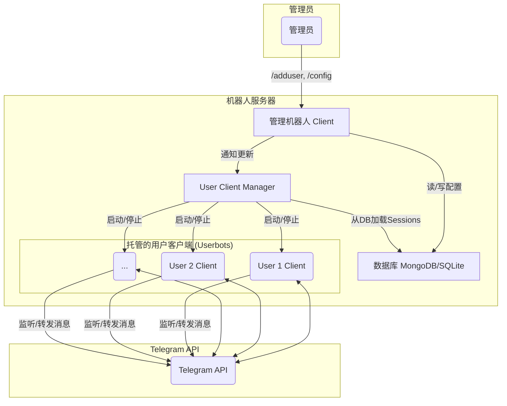

# Telegram 消息转发机器人架构方案

## 1. 项目概述

本项目旨在创建一个功能强大的 Telegram 消息转发机器人。核心功能是允许管理员托管多个 Telegram 用户账号，并为每个托管账号配置消息转发规则，实现从指定来源（私聊、群组、频道）到指定目的地的自动消息转发。

机器人将分为两部分：
- **管理机器人 (Bot Client)**: 一个标准的 Telegram Bot，用于管理员与系统交互，如添加/删除托管用户、配置转发规则等。
- **用户客户端 (User Clients)**: 多个以用户身份运行的 Pyrogram 客户端实例（Userbots），负责监听源消息并执行转发。

## 2. 核心功能

1.  **多用户托管**:
    *   管理员可以通过命令动态添加新的用户账号进行托管。
    *   授权过程安全，通过类似 `handle_security_check_start` 的流程引导用户提供电话、验证码和两步验证密码，获取并加密存储 `session_string`。
    *   可以随时暂停或删除某个用户的托管。

2.  **自动消息转发**:
    *   为每个托管用户独立配置转发规则。
    *   转发逻辑基于 `message_pm`，并进行扩展，支持更多消息类型。
    *   支持多种转发来源：私聊、群组、频道。
    *   支持多种转发目的地：私聊（如管理员）、指定的群组或频道。
    *   能够正确处理文本、图片、视频、文件等多种消息类型，并保留原始格式。

3.  **持久化存储**:
    *   使用数据库（推荐 MongoDB 或 SQLite）存储所有关键信息，包括：
        *   托管用户的 `user_id` 和加密后的 `session_string`。
        *   每个用户的转发规则配置（源、目的地、白名单/黑名单关键词等）。
        *   机器人的管理员列表。

4.  **日志管理**:
    *   记录详细的运行日志，包括：
        *   启动和关闭事件。
        *   用户托管操作（添加、删除）。
        *   消息转发成功和失败的记录。
        *   关键错误和异常。
    *   日志可以输出到控制台和指定的日志文件。

## 3. 技术架构

### 3.1. 框架与组件

*   **核心框架**: `Pyrogram` (同时使用其 `Client` for Bot 和 `Client` for User Account)
*   **数据库**: `Motor` (用于 `MongoDB` 的异步驱动) 或 `peewee-async` (用于 `SQLite/PostgreSQL` 的异步ORM)。MongoDB 更适合灵活的规则配置。
*   **调度**: `apscheduler` 的异步版本，用于可能的定时任务（如每日报告）。
*   **并发模型**: `asyncio`

### 3.2. 架构图

### 3.3. 模块设计

-   `main.py`: 程序入口。负责初始化数据库、日志、启动管理机器人和 User Client Manager。
-   `config.py`: 存放基本配置，如 `API_ID`, `API_HASH`, `BOT_TOKEN`, `DATABASE_URL`, `LOG_CHANNEL`。
-   `database/`: 数据库模型和操作模块。
    -   `models.py`: 定义数据模型（如 `ManagedUser`, `ForwardingRule`）。
    -   `manager.py`: 提供数据库的 CRUD (增删改查) 接口，如 `add_user`, `get_user_session`, `save_rule`。
-   `bot/`: 管理机器人相关代码。
    -   `main.py`: 初始化并运行 Bot Client。
    -   `handlers/`: 存放不同命令的处理器。
        *   `auth.py`: 处理用户授权流程 (`/adduser`)。
        *   `manage.py`: 处理用户管理 (`/deluser`, `/listusers`)。
        *   `rules.py`: 处理转发规则配置 (`/addrule`, `/delrule`)。
-   `user_clients/`: 托管用户客户端相关代码。
    -   `manager.py`: **User Client Manager**。负责在程序启动时，从数据库加载所有托管用户的 session，为每个用户创建一个 `Client` 实例，并使用 `asyncio.gather` 同时运行它们。
    -   `handlers.py`: 托管用户客户端的核心消息处理器。通过一个统一的辅助函数 `handle_notification_and_forward` 来处理所有消息，确保无论是自定义规则还是默认行为，其处理逻辑（如发送富通知）都是一致的，仅在目标 chat_id 上有所不同。

## 4. 实施步骤

1.  **环境搭建**:
    *   创建项目结构目录。
    *   初始化 `git` 仓库和 `.gitignore` 文件。
    *   创建 `pyproject.toml` 并添加 `pyrogram`, `motor`, `apscheduler` 等依赖，使用 uv 进行现代化依赖管理。

2.  **配置与数据库**:
    *   实现 `config.py`。
    *   实现 `database/` 模块，完成用户和规则的数据库模型及操作函数。对 `session_string` 进行简单的加密/解密处理。

3.  **用户授权流程**:
    *   在 `bot/handlers/auth.py` 中，借鉴 `check_auth.py` 的 `handle_security_check_start` 函数逻辑。
    *   创建一个 `/adduser` 命令，引导管理员完成添加新托管用户的流程。
    *   成功获取 `session_string` 后，调用 `database` 模块将其存入数据库。

4.  **User Client Manager**:
    *   实现 `user_clients/manager.py`。
    *   编写一个 `start_all_clients` 函数，该函数：
        *   从数据库获取所有激活的托管用户。
        *   遍历用户，为每个用户创建一个 `pyrogram.Client` 实例，使用其 `session_string`。
        *   为每个 Client 实例注册 `user_clients/handlers.py` 中的消息处理器。
        *   使用 `asyncio.gather` 启动所有客户端。

5.  **消息转发逻辑**:
    *   在 `user_clients/handlers.py` 中，核心逻辑被封装在 `handle_notification_and_forward` 辅助函数中。
    *   此函数负责生成详细的通知（针对私聊和群组提及）并转发原始消息。
    *   主处理器 `message_handler` 首先检查是否有自定义规则匹配。
    *   **自定义规则**: 如果找到匹配的规则，则对规则中定义的每个 `destination_chat` 调用 `handle_notification_and_forward`。
    *   **默认行为**: 如果没有匹配的自定义规则，则给收到消息的 `client` 作为目标 chat_id 调用 `handle_notification_and_forward`。
    *   所有消息发送全部使用 `bot_client` 发送，避免重复创建 `Client` 实例。
    *   这种统一的设计确保了行为的一致性，简化了维护工作。

6.  **管理功能完善**:
    *   实现 `/deluser`, `/listusers`, `/addrule`, `/delrule` 等管理命令。
    *   当规则更新时，需要考虑如何通知正在运行的 `User Client` 重新加载配置，或者直接重启该 `Client`。

7.  **日志和错误处理**:
    *   在整个应用中集成 `logging` 模块。
    *   在关键部分（如消息转发、用户登录）使用 `try...except` 捕获异常并记录日志。

8.  **主程序入口**:
    *   在 `main.py` 中，按顺序调用初始化函数，并 `await asyncio.gather()` 同时运行管理机器人和 `User Client Manager`。

## 5. 风险与挑战

*   **Pyrogram 账号封禁**: 过于频繁的操作或被识别为垃圾信息发送者可能导致托管的用户账号被 Telegram 限制或封禁。需要控制 API 调用频率。
*   **并发管理**: 管理大量 User Client 实例会消耗较多内存和CPU资源。代码需要高效，避免不必要的阻塞。
*   **状态同步**: 当管理员更新转发规则时，需要有机制让正在运行的 User Client 感知到变化。可以考虑使用内存缓存或在每次消息处理时查询数据库。对于高并发场景，可以引入 Redis 等缓存系统。

此方案为初步设计，具体实现时可根据需求进行调整和优化。 